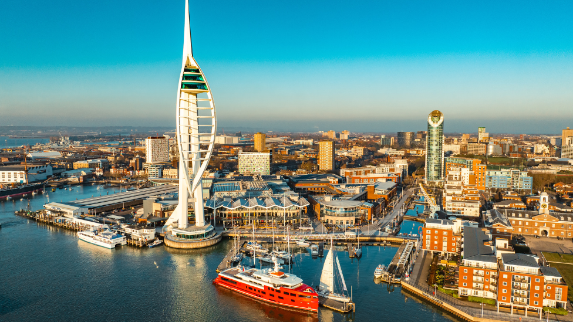

# Our Conference Location: Portsmouth

  The Spring 2027 ASAB Conference will be taking place in our historic port in the south of England.

## Conference Venues

  

    <figure class="post-card__thumb">
      
    </figure>

    

      

        <h2>Main Lecture Theatre</h2>
      

      
The XXXX building is where all talks shall be.

    

  

    <figure class="post-card__thumb">
      
    </figure>

    

      

        <h2>Poster Area</h2>
      

      
info about the location / area where the poster session will be.

    

  

    <figure class="post-card__thumb">
      
    </figure>

    

      

        <h2>Social</h2>
      

      
info about where the social event is going to be held.

    

  

<h2 style="margin-top: 70px;">What to see</h2>
<ul>
  <li>
    <strong>Spinnaker Tower</strong> : A 170-metre landmark offering panoramic views across Portsmouth Harbour and the Solent River. Visit the Sky Bar for cocktails at sunset!
  </li>
    <li>
    <strong>Gunwarf Quays</strong> : A premium waterfront outlet in Portsmouth featuring over 90 designer stores, 30 international restaurants, and the iconic Spinnaker Tower.
  </li>
  <li>
    <strong>Portsmouth Historic Dockyard</strong> : Home to historic ships, museums and naval exhibitions.
  </li>
  <li>
    <strong>Southsea</strong> : A lively seafront area with beaches, cafés and views across to the Isle of Wight.
  </li>
</ul>

## How to get there
<ul>
  <li>
    <strong>Airports</strong> : Southampton Airport is the closest to the city, whereas London Gatwick and London Heathrow offer great international travel options
  </li>
  <li>
    <strong>Train</strong> : Gatwick Airport offers a direct hourly Southern or Thameslink train service to Portsmouth & Southsea, taking approximately 1 hour and 30 minutes. South Western Railways offers a direct service from Waterloo Station.
  </li>
    <li>
    <strong>Driving</strong> : For convenient and central campus parking, use the Isambard Kingdom Brunel multi-storey car park. Gunwarf Quays also offers a discounted rate for students and staff commuting to Portsmouth.
  </li>
  <li>
    <strong>Hovercraft</strong> : 10 minutes from the Isle of Wight!
  </li>
</ul>

## Where to Eat and Drink 
<ul>
    <li>
    <strong>Gunwarf Quays</strong> : A range of resturants available, with outdoor seating overlooking the marina.
  </li>
  <li>
    <strong>Portsmouth Historic Dockyard</strong> : Home to historic ships, museums and naval exhibitions.
  </li>
  <li>
    <strong>Southsea</strong> : A lively seafront area with beaches, cafés and views across to the Isle of Wight.
  </li>
</ul>

## Where to stay 
<ul>
    <li>
    <strong>AirBnB</strong> : A range of self-catering options available
  </li>
  <li>
    <strong>Hotels</strong> : The Ibis, Travelodge and Holiday Inn are all within a 10-minute walk to the University
  </li>
</ul>

